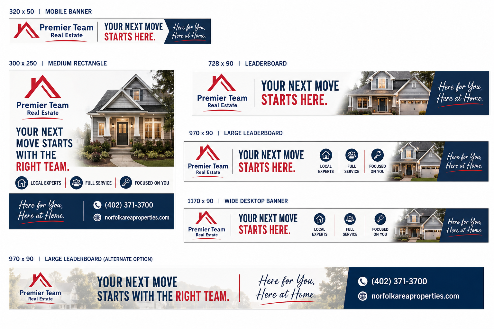

# BE KNOWN  
# BEFORE YOU'RE NEEDED.

### Premier Team Real Estate × Norfolk Daily News

A year-long advertising strategy designed to build Premier Team's visibility across print, digital, sports and community.

**$240/month**

All-Star Sports Partnership + Year-Round Digital Strategy

---

# WHY ADVERTISE?

## Real estate decisions don't happen every day.

Someone who sees Premier Team today may not be ready to buy or sell today.

Consistent visibility builds recognition **before** that decision arrives.

### Awareness → Familiarity → Trust → Consideration → Action

**The goal isn't to make someone need a Realtor today.  
It's to make Premier Team familiar when they do.**

---

# CONTINUED PRESENCE IN THE MARKETPLACE

## Be present even when they're not ready.

Real estate has a long decision cycle.

Families grow. Kids leave home. Jobs change. People retire, inherit property, downsize, relocate—or simply decide it's time for something different.

Advertising creates opportunities for Premier Team to remain visible **between those moments of need.**

### More touchpoints → More familiarity → More opportunity to be remembered

**When real estate suddenly matters, Premier Team shouldn't be introducing itself for the first time.**

---

# DIFFERENT MEDIA. DIFFERENT STRENGTHS.
## One recognizable Premier Team presence.

### PRINT
Local presence + established readership

### DIGITAL
Reach + repetition throughout the year

### SPORTS + COMMUNITY
Connection to local teams, achievements and community pride

### SOCIAL
Properties + expertise + ongoing engagement

---

## The strategy isn't to reach everyone in the same place.

It's to create multiple opportunities for people to **see, recognize and remember Premier Team.**

---

# THE ALL-STAR PARTNERSHIP

## One package. Multiple opportunities to stay visible.

# 6  |  8  |  10  |  60K

**NEWS ADS**  
3-column × 5-inch B&W

**SPORTS FRONT ADS**  
6-column × 3-inch full color

**COMMUNITY RECOGNITION**  
Local athletic achievements + state qualifiers

**DIGITAL IMPRESSIONS**  
Included digital display advertising

### $2,700 partnership

---

# MAKE THE DIGITAL WORK ALL YEAR.

# 60K + 60K = 120K

**60,000 included impressions**

+

**60,000 additional impressions for only $180**

=

# 120,000 TOTAL DIGITAL IMPRESSIONS

## 10,000 impressions every month × 12 months

Because the partnership qualifies Premier Team for the **$3 CPM add-on rate**, year-round digital visibility costs just **$180 more for the entire year.**

---

# SPORTS FRONT

### 6-column × 3-inch • Full Color

**Team + Community**

Full-color creative gives Premier Team an opportunity to put recognizable faces alongside its brand and its connection to the community.

---

# NEWS

### 3-column × 5-inch • Black & White

**Brand + Real Estate**

Black-and-white doesn't have to be a lesser version of the color creative.  
The message and design can be built specifically for the medium.

---

# DIGITAL DISPLAY

### Five sizes. One coordinated campaign.

**320×50 • 300×250 • 728×90 • 970×90 • 1170×90**

One campaign adapts across available placements while maintaining a recognizable Premier Team identity.

---

# PUT $240 IN PERSPECTIVE.

## $232.50
### ONE 3×5 B&W NEWS AD

vs.

## $444
### ONE 6×3 FULL-COLOR SPORTS FRONT AD

vs.

# $240 / MONTH
## THE RECOMMENDED YEAR-LONG PREMIER TEAM STRATEGY

Print • Digital • Sports • Community

---

# ONE PREMIER TEAM PRESENCE.
## A shared investment.

The total recommended strategy is:

# $240 / MONTH

If the investment is shared among participating Realtors:

| Participating Realtors | Monthly Cost Per Realtor |
|---:|---:|
| 3 | **$80.00** |
| 6 | **$40.00** |
| 9 | **$26.67** |
| 12 | **$20.00** |
### ALL 14 REALTORS → **$17.14/month each**
### Premier Team determines how the investment is shared internally.

---

# BE PRESENT.
# BE RECOGNIZED.
# BE THERE WHEN THEY'RE READY.

## $240 / MONTH

One coordinated Premier Team presence across print, digital, sports and community throughout the year.

**Same Premier Team. More touchpoints. Continued visibility.**

---

### Shannon Dobler
Media Sales Consultant  
Norfolk Daily News & WJAG Radio Group

**12-month commitment • $2,880 total annual investment**
